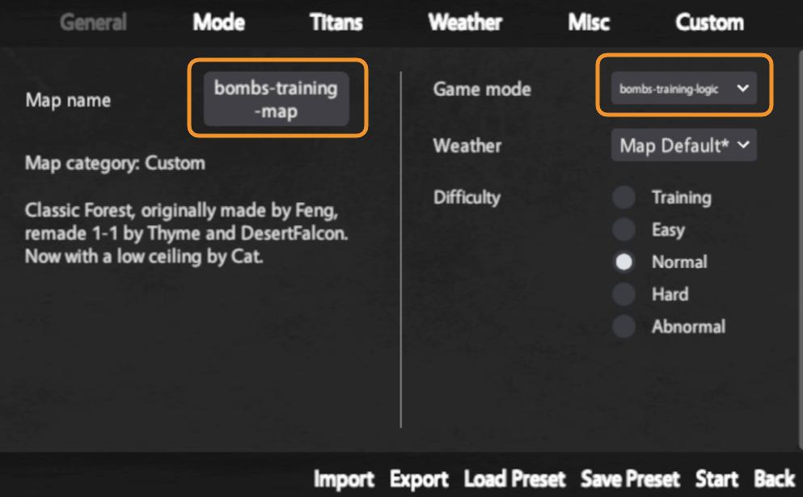
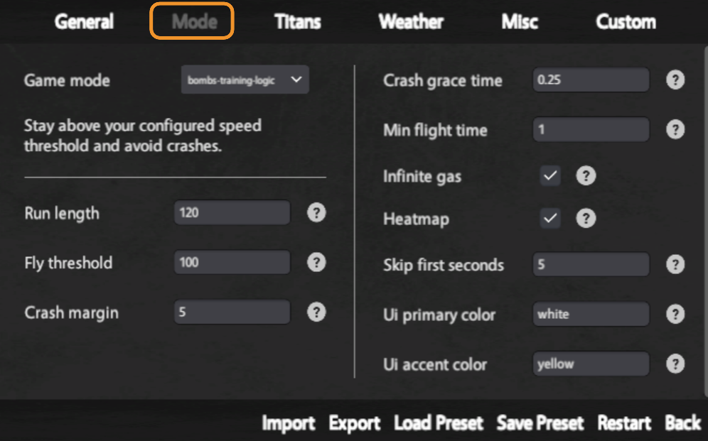
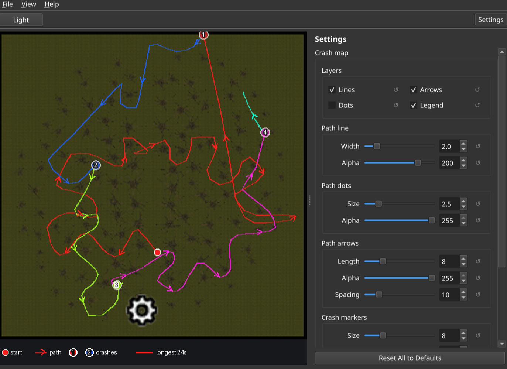
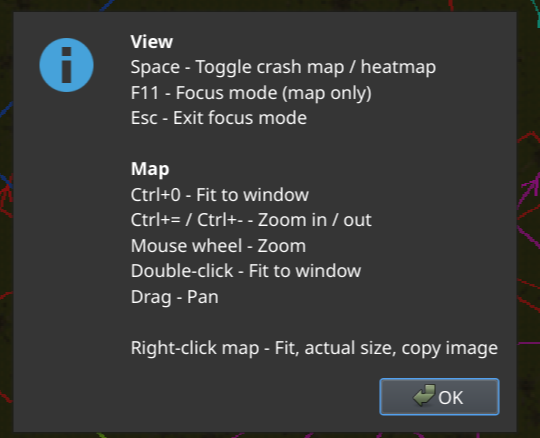

# Bombs Training

## Usage

1. Download **bombs-training-windows.zip** from [Releases](../../releases).
2. Unzip anywhere, run **bombs-training.exe**.
3. **File -> Install to AoTTG2**
4. In-game: choose custom map **bombs-training-map**, game mode **bombs-training-logic**



**Custom logic settings.** Run length, speed threshold, and other options in the game mode panel.



If you want bomb-mode thunderspears, turn on Thunderspear PVP under Misc when creating the room.

5. Leave the app open. Maps update when a run ends.

**Viewer.**



**Help->Keyboard shortcuts.**



---

## Dev

```bash
git clone https://github.com/furizan/bombs-training.git && cd bombs-training
python3 -m venv .venv && source .venv/bin/activate
pip install -r requirements-dev.txt && python app.py
```

Tests: `pytest`. Release: `git tag v0.1.0 && git push origin v0.1.0`
